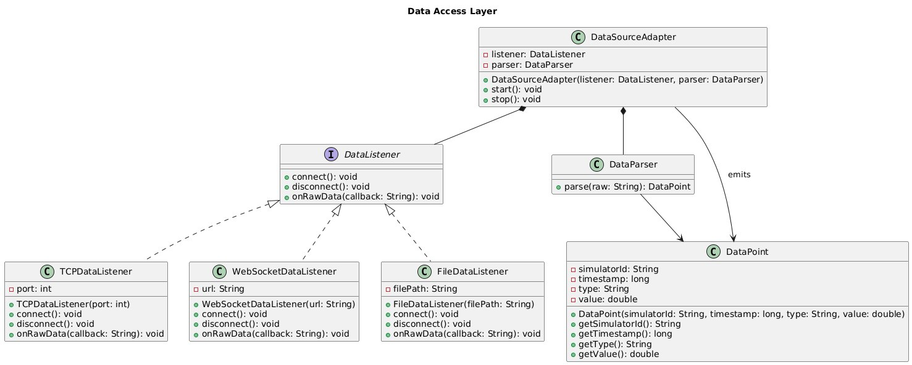

# Data Access Layer



**Figure 1.** UML class diagram for the data-access subsystem of CHMS.

## Rationale

The Data Access Layer cleanly separates transport protocols, parsing logic, and delivery of domain objects. At its core, **DataListener** defines a uniform interface for connecting, disconnecting, and receiving raw data. Three concrete implementations—**TCPDataListener**, **WebSocketDataListener**, and **FileDataListener**—handle protocol-specific details without affecting downstream logic.

Once raw messages arrive, **DataParser** takes responsibility for interpreting them (e.g., JSON, CSV) and instantiating a uniform **DataPoint** object. Centralizing parsing ensures that if input formats evolve, only this one class needs modification.

The **DataSourceAdapter** composes a `DataListener` and a `DataParser`. Calling `start()` on the adapter connects the listener, subscribes to raw data events, parses each payload into a `DataPoint`, and emits it to higher-level subsystems (such as storage or analytics). The `stop()` operation cleanly tears down the listener, enabling graceful shutdown. By encapsulating both listening and parsing in a single adapter, the rest of CHMS can operate purely on fully-formed domain data, oblivious to the transport and format.

This design adheres to single-responsibility and open-closed principles. Adding a new transport (e.g., MQTT) requires only a new `DataListener` implementation; adjusting for a new file format (e.g., XML) involves updating or extending `DataParser`. No existing classes need to change. This modular approach ensures maintainability, enhances testability, and supports future extensions without risking core system stability.```
