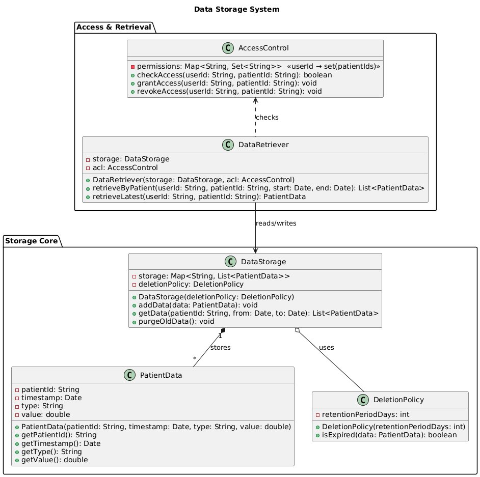

# Data Storage System

DataStorage is the central repository for all incoming patient vitals. It maps each patient’s unique ID to a list of PatientData objects. Each PatientData encapsulates one timestamped measurement—its type field allows storing heterogeneous signals (e.g., “ECG,” “BloodPressure”) in a single store.

To implement data deletion policies, DataStorage is composed with a DeletionPolicy object. The policy’s retentionPeriodDays determines how long data is kept; invoking purgeOldData() iterates through stored records and removes any for which isExpired() returns true. This cleanly separates retention logic from core storage.

Since patient data is sensitive, the AccessControl class manages which users (identified by userId) may read a given patient’s data. Permissions are stored as a map from user IDs to sets of patient IDs. checkAccess() enforces this at query time, while grantAccess() and revokeAccess() allow dynamic changes to access rights.

Finally, the DataRetriever class provides the interface that medical staff or higher-level subsystems use to query data. On each request (retrieveByPatient or retrieveLatest), it first calls into AccessControl to verify permissions, then delegates to DataStorage to fetch the records. By isolating access checks here, we ensure that nobody can accidentally bypass privacy rules, and the underlying storage remains unaware of user‐level policies.

This modular design satisfies the requirements for secure storage and retrieval, timestamp/versioning support, deletion policies, and strict access control—while keeping each class focused on a single responsibility.