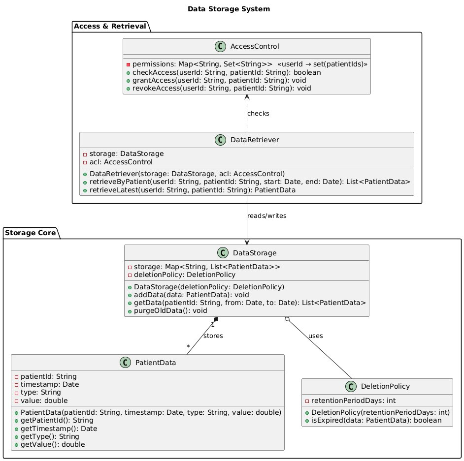

# Patient Identification System

## Rationale

In the CHMS, every incoming data point must be accurately tied to a real patient record.
- **PatientIdentifier** encapsulates the matching logic: its `match(simulatorId: String): HospitalPatient` method looks up the simulator-supplied ID in the hospital’s directory and returns a `HospitalPatient` object or throws `PatientNotFoundException` if no match is found.
- **HospitalPatient** holds immutable, sensitive details (e.g., `patientId`, `name`, `dateOfBirth`, `medicalHistory`). By modeling it as a distinct class, we ensure that only this entity carries personally identifiable information, and that downstream subsystems never see raw lookup tables.
- **IdentityManager** oversees overall integrity: it composes a `PatientIdentifier`, handles retries or fallback rules (via its `resolveDataPoint()` operation), and logs anomalies for audit. If `PatientIdentifier` fails, `IdentityManager` can route the data point to a quarantine queue rather than dropping it silently.

This design cleanly separates lookup (in `PatientIdentifier`), data ownership (in `HospitalPatient`), and higher-level error handling & logging (in `IdentityManager`). It also gives us a single place to add future features such as fuzzy matching or fallback to secondary data sources without touching the lower‐level matching code.
